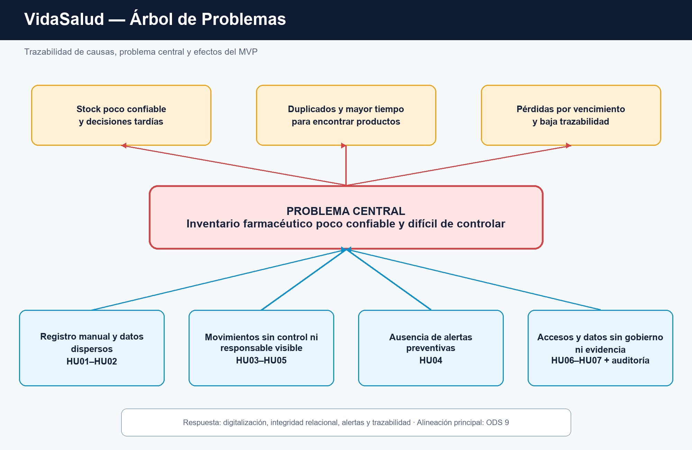

# Análisis del problema

El Árbol de Problemas relaciona las causas operativas observadas con las historias implementadas.
Debe presentarse junto con la matriz de `TRAZABILIDAD.md`; no representa requisitos clínicos,
financieros ni regulatorios fuera del alcance de VidaSalud.

- `ARBOL_PROBLEMAS.puml`: fuente editable.
- `ARBOL_PROBLEMAS.png`: imagen para GitHub, informe y stand.
- `../TRAZABILIDAD.md`: recorrido verificable desde la causa hasta la base de datos.

