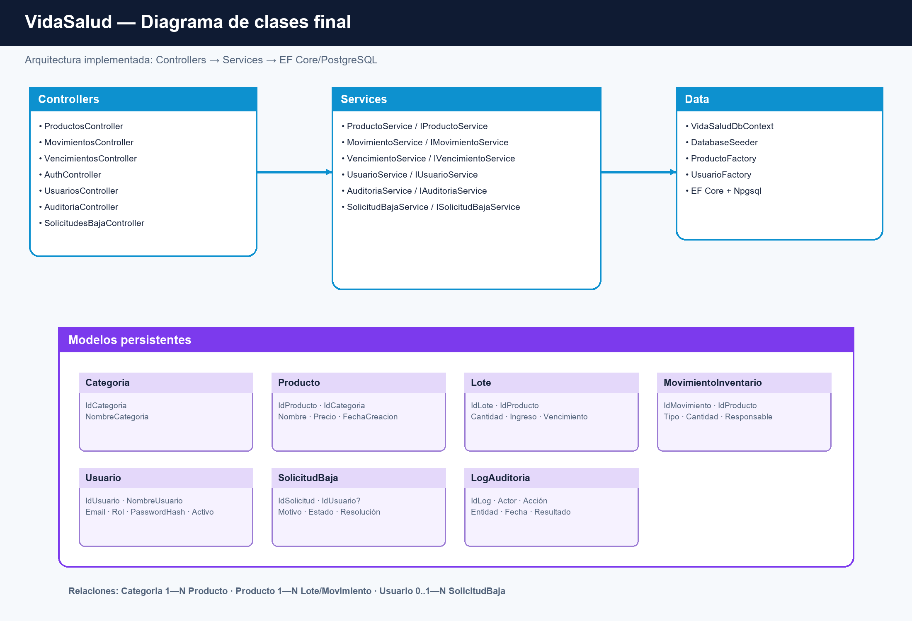

# UML final

Estos diagramas representan el código implementado al cierre del MVP. Se mantienen separados de
los diagramas históricos de cada sprint para evitar afirmar que clases propuestas, como un
`ProductoRepository`, existen en la implementación actual.

- `DIAGRAMA_CLASES_FINAL.puml`: arquitectura de API y entidades persistentes.
- `HU01_REGISTRAR_PRODUCTO.puml`: producto y lote inicial.
- `HU02_CONSULTAR_PRODUCTOS.puml`: listado, búsqueda parcial y cálculo de stock.
- `HU03_REGISTRAR_MOVIMIENTO.puml`: entrada/salida y validaciones.
- `HU04_CONSULTAR_VENCIMIENTOS.puml`: alertas dinámicas.
- `HU05_INICIAR_SESION.puml`: credenciales, cuenta activa y auditoría.
- `HU06_GESTIONAR_USUARIOS.puml`: administración y hash de contraseñas.
- `HU07_DATOS_PERSONALES.puml`: perfil, baja y auditoría.

Cada fuente tiene una imagen `.png` con el mismo nombre para abrirla directamente desde GitHub o
incorporarla al Informe Final. Las fuentes `.puml` siguen siendo la referencia editable.

Para regenerar las imágenes sin instalar Java ni PlantUML:

```powershell
python render_diagrams.py
```

El script requiere Pillow y está pensado como respaldo local para el proyecto académico.

## Vista principal



Las secuencias renderizadas pueden abrirse desde:

- [HU01 — Registrar producto](HU01_REGISTRAR_PRODUCTO.png)
- [HU02 — Consultar productos](HU02_CONSULTAR_PRODUCTOS.png)
- [HU03 — Registrar movimiento](HU03_REGISTRAR_MOVIMIENTO.png)
- [HU04 — Consultar vencimientos](HU04_CONSULTAR_VENCIMIENTOS.png)
- [HU05 — Iniciar sesión](HU05_INICIAR_SESION.png)
- [HU06 — Gestionar usuarios](HU06_GESTIONAR_USUARIOS.png)
- [HU07 — Datos personales](HU07_DATOS_PERSONALES.png)
